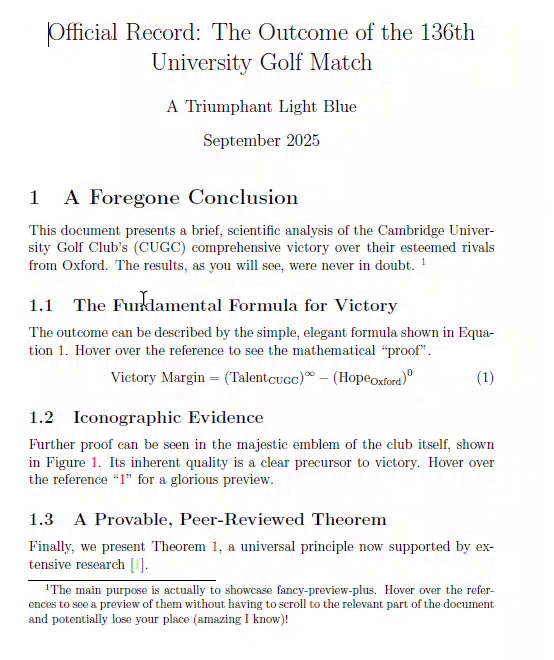

# Fancy Preview Plus

A Perl script that enhances LaTeX documents by automatically generating interactive, on-hover tooltips for citations, figures, equations, and more.

This script orchestrates a multi-pass compilation of a LaTeX source file to produce a self-contained, interactive PDF. It is a heavily modified and debugged version of the original `fancy-preview` script by Robert Marik.

## Showcase

This script transforms standard LaTeX documents into interactive PDFs. Hover over references for citations, figures, equations, and theorems to see live previews without losing your place.



*(This example was generated from the self-contained MWE included in the repository.)*

## Minimal Working Example (MWE)

The MWE.tex file is a (not quite) minimal working example. Make sure CUGC.JPG is in the same folder and then run `perl fancy-preview-plus.pl MWE`

## Features

* **Interactive Tooltips:** Creates on-hover popup previews for document elements.
* **Fil Size Optimization:** Integrated Ghostscript to compress tooltip data, significantly reducing the final PDF's file size.
* **Broad Support:** Generates tooltips for:
    * **Citations:** Shows the full bibliographic entry on hover (requires `biblatex`).
    * **Figures & Tables:** Displays the full figure or table.
    * **Equations:** Shows the rendered equation.
    * **Theorem-like Environments:** Supports `theorem`, `lemma`, `definition`, etc.
* **Selective Generation:** Use the `--types` flag to specify exactly which tooltips you want to build (e.g., just citations).
* **Customizable:** Easily change the tooltip's background color, border color, and content scale by editing variables at the top of the script.

## Requirements

To use this script, you will need:
* A working **Perl** installation.
* A **LaTeX distribution** (like TeX Live, MiKTeX).
* **Ghostscript**: Required for the PDF compression feature. Make sure the executable (`gs` on Linux/macOS, `gswin64c` on Windows) is in your system's PATH.
* The `biber` command for `biblatex` support.
* The `pdfcrop` utility (usually included with TeX Live).
* The following LaTeX packages installed: `fancytooltips`, `preview`, `biblatex`, `tikz`, `hyperref` and the bundled packages with `acrotex`.

## Configuration

You can easily customize the script's behaviour by editing the variables in the "User Configuration Section" at the top of the file.

**Tooltip Appearance**
* `$tooltip_bg_color`: Change the background color (e.g., `"yellow!10"`).
* `$tooltip_border_color`: Change the border color (e.g., `"black!50"`).

**Ghostscript Compression**
* `$use_ghostscript`: Set to `1` to enable compression or `0` to disable it.
* `$ghostscript_options`: To increase compression for the smallest possible file size, change `-dPDFSETTINGS=/ebook` to -dPDFSETTINGS=/screen`.

## Usage

The script is designed to be the **only** command you need to run. It handles the full `pdflatex -> biber -> pdflatex -> ...` cycle.

### 1. Basic Command

Run the script from your terminal, passing your main `.tex` file as an argument (with no file extension)
```cmd
perl fancy-preview-plus.pl <TEX_FILENAME>
```

### 2. Best Practice: Start Clean

For the most reliable results, always delete all temporary LaTeX files before running the script.

**On Windows (Command Prompt):**
```cmd
del -f *.aux *.bbl *.bcf *.blg *.log *.out *.run.xml *.tmp *-crop.pdf minimal.*
```
